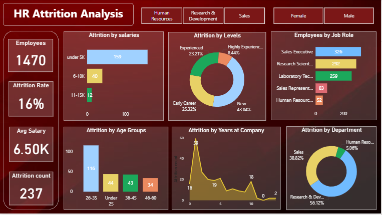

## Overview

This project analyzes employee attrition using Power BI. 
The goal is to understand why employees leave the company and find ways to improve retention.

Objectives
Analyze overall attrition in the company
Find departments and job roles with high attrition
Understand how salary, experience, and age affect attrition
Provide insights for better workforce decisions

Dataset
The dataset contains employee details such as Age, Department, Job Role, Monthly Income, 
Job Satisfaction, Work Life Balance, Years at Company, and Attrition.

Data Preparation
- Removed unnecessary columns
- Created Age Groups
- Created Experience Groups (Entry-Level, Junior, Mid, Senior)
- Created Income Groups
- Cleaned data and fixed data types

Insights:

- Overall attrition rate is around 16 percent, showing a noticeable number of employees leaving the company.
- Employees at entry level have higher attrition compared to experienced employees.
- Employees with lower salary are more likely to leave the company.
- Sales and R&D departments have higher attrition compared to other departments.
- Some job roles like Sales Executive have higher employee turnover.

Tool
 Power BI
 

 Dashboard
 
 

Conclusion
This project helps in understanding employee attrition patterns.
It can help companies improve employee retention and make better decisions related to salary and workforce planning.
